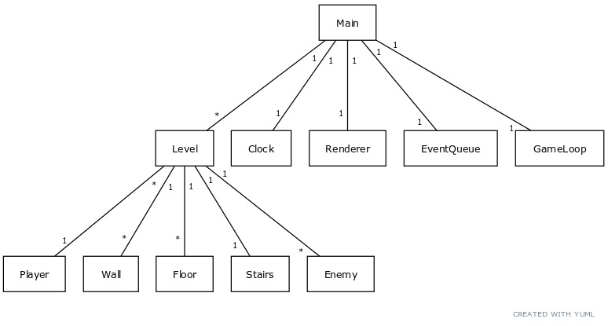
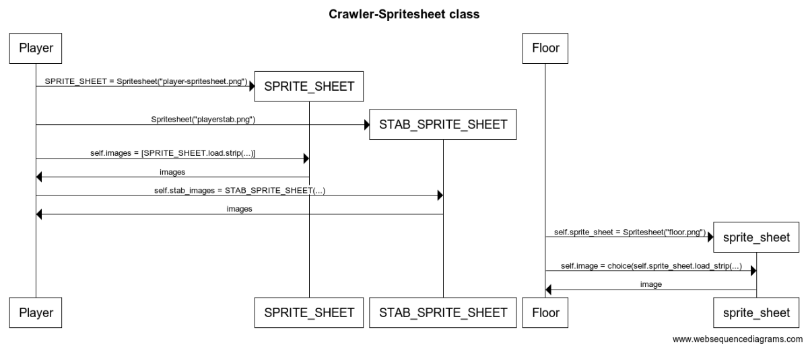

<h1>Arkkitehtuurikvaus</h1>
<h2>luokkarakenne</h2>
Main-luokka luo kaikki tarvittavat oliot pelin toimintaa varten ja hallitsee niitä. Main-olio on siis parent-luokka kaikille. Main-olio luo itselleen Clock-, Renderer-, EventQueue-, Gui- ja GameLoop-oliot, jotka ovat vastuussa pelin päivityksestä ja siitä, että asiat piirtyvät näytölle oikein, pelin sisällä aika kuluu jne. Mielenkiintoisin olioista on Level, jonka sisälle kaikki pelin logiikka sijoittuu. Level-olio itsessään luo itselleen tarvittavia olioita sen perusteella millainen rakenne sillä kyseisellä Level-oliolla on. Level olio luo itselleen Player-, Wall-, Floor-, Stairs-, Slime- ja Ranger-olioita riippuen siitä, millaiset ohjeet main-olio on antanut eteenpäin.

 

<h2>Sekvenssikaavio Spritesheet-luokan toiminnasta</h1>

<h2>Sovelluslogiikka:</h2>
Sovellus toimii Pythonin pygame-kirjastolla. Ideana on se, että sovellus on jatkuvassa loopissa, joka päivittää itseään 60 kertaa sekuntissa. Jokaisella päivityskerralla näytölle piirretään oikeassa järjestyksessä haluttavat asiat (perimmäisimpänä aivan musta tausta, sitten lattia, sitten seinät, sitten pelajat, viholliset ym.) päivityksen yhteydessä myös tehdään haluttavat päivitykset pelilogiikan sisällä: saako pelaaja kävellä tiettyyn kohtaan, ottaako jokin asia vahinkoa jostain ym. Päivityksen aikana tarkastetaan myös käyttäjän antamat syötteet, mitkä vaikuttavat pelin kulkuun. 