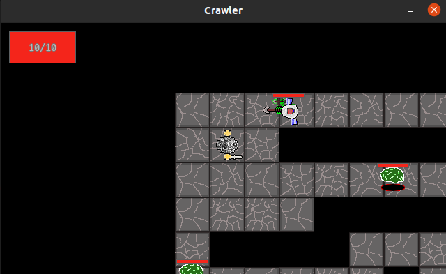
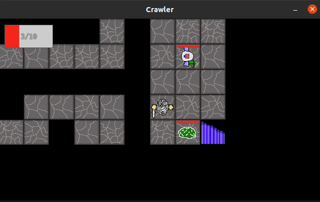
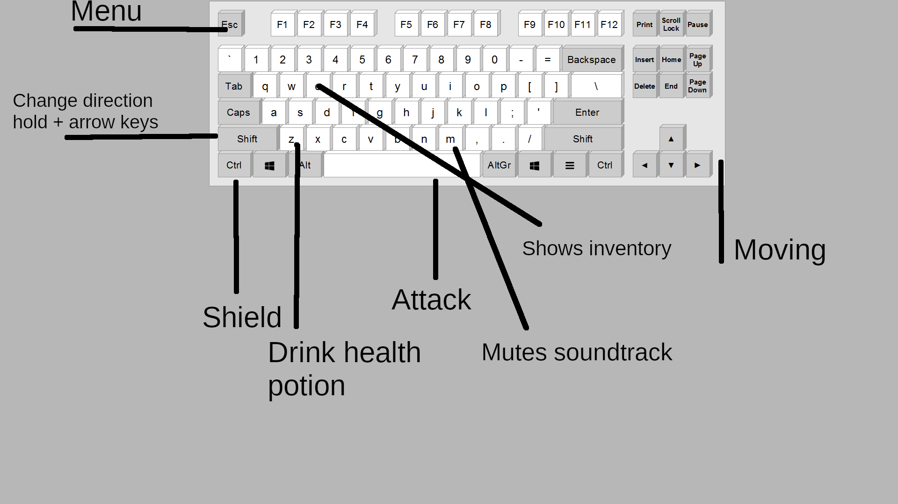

<h1>Käyttöohje</h1>

Lataa projektin <a href="https://github.com/mcdongo/ot-harjoitustyo/releases/tag/viikko6">viimeisimmän releasen lähdekoodi</a> 

Ohjelma asennetaan komennolla:
> poetry install

Ohjelman pystyy suorittaa komennolla:
> poetry run invoke start

Testit pystyy suorittaa komennolla:
> poetry run invoke test

Ja testikattavuuden saa suorittamalla komennon:  
> poetry run invoke coverage-report

Pylintillä voi testata koodin siisteyttä seuraavalla komennolla:  
> poetry run invoke lint

Sovelluksessa ei ole vielä tällä hetkellä mitään tallennustapaa tai alkumenua. Peli käynnistyy suoraan kun käsky ajetaan komentoriviltä.

Tällä hetkellä peli näyttää tältä.
Hahmo, jolla on miekka kädessä on pelaaja. Vasemmassa ylänurkassa näkyy pelaajan senhetkiset elämäpisteet. Muut hahmot näytöllä ovat vihollisia, joiden elämäpisteet näkyvät niiden päällä. Pelaajaa liikutetaan nuolinäppäimistä. Jos painaa vasnta shift -näppäintä ja nuolinäppäintä samaan aikaan pelaaja kääntyy siihen suuntaan kuitenkaan pois liikkumatta ruudustaan. Jos painaa vasenta ctrl-näppäintä, pelaaja nostaa kilven ylös ja ei ota vahinkoa esimerkiksi ranger-vihollisen nuolista (mikäli pelaaja katsoo oikeaan suuntaan). Myöskin spacebaria painamalla pelaaja hyökkää suoraan edessä olevaan ruutuun.

Jokaisessa huoneessa on jossain tämän kaltaiset rappuset, jotka on löydettävä edetäkseen seuraavaan kerrokseen. Tällä hetkellä pelissä on vain kaksi eri kerrosta.

Kuvassa näkyy pelissä käytettävät kontrollit